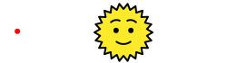
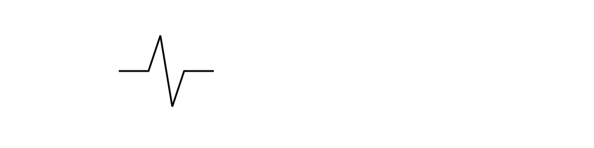
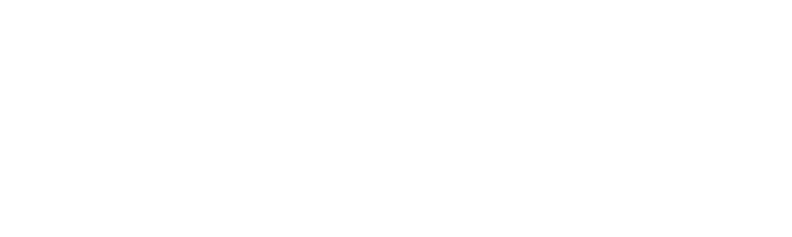
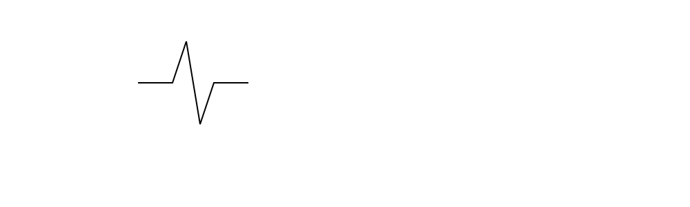
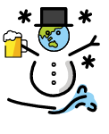
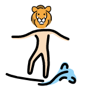
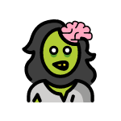
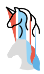
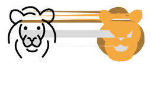
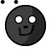

<h1>SVG-Glitch Doku</h1>

## **Aufgabenstellung**

In diesem Projekt sollten wir uns mit der Struktur von SVG - Vektorgrafiken auseinandersetzen und diese systematisch verändern bzw. glitchen. Wir haben uns dazu entschieden SVG Emojis zusammenzufügen und dadurch neue Emojis zu erstellen. 
Die geglitchten Emojis haben wir durch das editieren verschiedener oder durch das hinzufügen neuer Parameter im Source Code der Emojis erstellt.

### **Viewport**

Der Viewport eines SVGs wird durch die `width` und `height` Attribute im &lt;svg&gt; tag definiert. Ein SVG Viewport hat den Koordinaten Nullpunkt oben links.
Die `viewBox` eines SVGs braucht vier Parameter und gibt an welcher Bereich des SVG Viewports gezeigt wird. Die ersten beiden bestimmen die Verschiebung vom Nullpunkt, die letzten beiden die Größe des Fensters. Dadurch lassen sich SVGs auch skalieren, da sich die gezeichneten Elemente an dem umschließenden Element ausrichten, das heisst je größer die `viewBox` desto kleiner das angezeigte SVG.

In diesem Beispiel ist die `viewBox` um 100 Einheiten nach rechts verschoben, so wird der negative Bereich der x-Achse gezeigt, während die Sonne sich noch immer am Nullpunkt befindet. Daher wird auch der Rote Kreis mit einem negativen x-Wert sichtbar, der sich bei einer `viewBox` an den Koordinaten 0, 0 ausserhalb des Sichtfelds befinden würde.

### **Path**

Das Attribut `d` des &lt;path&gt; tags beinhaltet die Koordinaten und Richtungsanweisungen nach denen sich der Pfad bewegt. Die Anweisungen werden mit M, L, H, V, C, S, Q, T und Z, wobei jede Anweisung als Groß oder Kleinbuchstabe angegeben werden kann. Versalien bedeuten dabei stets, dass die angegebenen Koordinaten absolute Koordinaten sind, während Kleinbuchstaben immer Koordinatenverschiebungen relativ zur aktuellen Position angeben. M bewegt z.B. einen imaginären Cursor zu den angegeben Koordinaten, L zieht eine Linie zu von einem Start zu einem Endpunkt. Auf diesem Wege lassen sich sowohl leicht grobe Umrisse skizzieren, als auch komplexe Muster und Formen erstellen.

### **Animate**
 Das Tag &lt;animate&gt; bzw. &lt;animateTransform&gt;, &lt;animateMotion&gt; und einige weitere Variationen erlauben das animieren von Elementen über verschiedene Parameter. `attributeName` gibt dabei an welches Attribut im Laufe der Animation verändert wird. &lt;animateTransform&gt; erlaubt Transformationsbasierte Animation wie wie z.B. das rotieren mit `rotate` oder skalieren mit `scale`, ausserdem sind einfache bewegungen mit `translate` möglich. Die Parameter `from` und `to` geben eine Start und Endposition des Animierten Elements an, `dur` die Dauer der Animation und `repeatCount` gibt an wie oft die Animation wiederholt werden soll.

Mit  &lt;animateMotion&gt; lassen sich Elemente an einem Pfad entlang bewegen und so komplexere Bewegungen animieren.

##  **Ergebnisse**

Die nun erlernten Fähigkeiten haben wir an einigen Emojis von der HfG - Openmoji Bibliothek ausprobiert.

### **Remix**

Die Emojis dieser Kategorie wurden durch das mixen einzelner Emojis entstanden bzw. durch das ersetzen bestimmter Teile eines Emojis mit anderen Emojis. Dafür haben wir den gewünschten Bereich eines Emojis entfernt und stattdessen als verschachteltes SVG das zweite Emoji eingesetzt. Anschließend haben wir die viewBoxen der einzelnen SVGs aufeinander abgestimmt.

## **Schneemann**
Die Grundlage für diese Kreation war ein Surfer-Emoji, dessen Körper mit einem Schneemann ersetzt wurde, dessen Kopf wiederrum mit dem Weltkugel Emoji ersetzt wurde, ausserdem hält er in der rechten Hand einen Krug Mango-Maracujaschorle mit Schlagsahne.

## **Surfing Lion**

Alle dem Kopf des Surfers zugehörigen Elemente wurden mit einem Löwenkopf SVG ersetzt.

## **Zombie**

Hier haben wir an der offenen stelle des Schädels ein Hirn eingefügt.

### **Verzerrt**
Diese Kunstwerke entstanden durch das verschieben der Füllfläche von Emojis, während die schwarzen Konturpfade nicht berührt worden sind. Die anderen Flächen und Details bestanden aus einer inkonsequenten Mischung aus Versalien und Kleinbuchstaben, sodass das verschieben der Startposition der Pfade nur einen gewissen Anteil des Elements betraf, so entstand eine Art aufteilender Effekt der ein Emoji in zwei Teile spaltet, aber dennoch verbunden bleibt durch die Absoluten Koordinatenangaben der Pfade.

## **Dripping Unicorn**

## **Split Lion**

### **Animiert**

Für die Krönung unserer Kollektion haben wir die Augen eines Mondemojis animiert, so dass sie sich hin und her bewegen. Das linke Auge funktioniert mit einem &lt;animateTransform&gt; tag, wo lediglich die Position langsam verschoben wird. Das rechte hingegen nutzt den &lt;animateMotion&gt; tag, um einem Pfad, in diesem Fall lediglich die horizontale Achse des Auges, zu folgen und so mit gleicher Geschwindigkeit sich von links nach rechts und zurück zu bewegen ohne ständig zurückzuzucken.

## **Hypnosemond**

Gute Nacht